# TRAVEL

| 링크 : [TRAVEL](https://travel.sjungwon.site)  
| 백엔드 링크 : [Backend](https://github.com/sjungwon/travel-backend)

## 프로젝트 소개

> TRAVEL은 여행 정보 공유 커뮤니티입니다.  
> 여행지 정보와 후기를 공유할 수 있습니다.  
> 여행지 후기를 조합해 여행 일정을 만들어 공유할 수 있습니다.  
> 추가 기능으로 숙소에 방을 만들고 예약할 수 있습니다.

### 기술 스택

- TS
- React

### 프로젝트 아키텍처

#### 1. CI/CD

- Github Action 사용
  - CI
    - main(master) 브랜치에 pull request 요청 시 빌드 진행
    - 빌드 가능할 때만 merge 가능
  - CD
    - main(master) 브랜치에 push 발생하면 빌드
    - 빌드한 파일을 압축 후 aws S3에 업로드

#### 2. 운영

- 프론트
  - Route53 - CloudFront(CDN) - S3
  - S3의 엔드포인트는 SSL을 지원하지 않아서 CloudFront 배포로 설정 후 Route53에서 CloudFront로 도메인 연결
  - 프론트도 Github Action으로 main 브랜치에 push 발생하면 build해서 S3에 업로드
  - S3에 업로드된 파일은 CloudFront(CDN)을 통해서 배포
- 전체적인 동작
  - 사용자는 Route53에 지정한 프론트 도메인으로 접속
  - CDN에 업로드된 프론트 빌드 파일 사용자에게 반환
  - 사용자는 React로 만들어진 SPA를 사용
  - 데이터가 필요할 때 React는 백엔드 서버로 데이터 요청
  - 프론트는 서버의 응답을 받아서 적절한 컴포넌트로 출력

### 기능

1. 여행지
   1. 여행지 조회  
      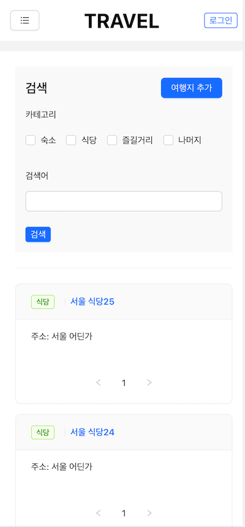
   2. 여행지 추가  
      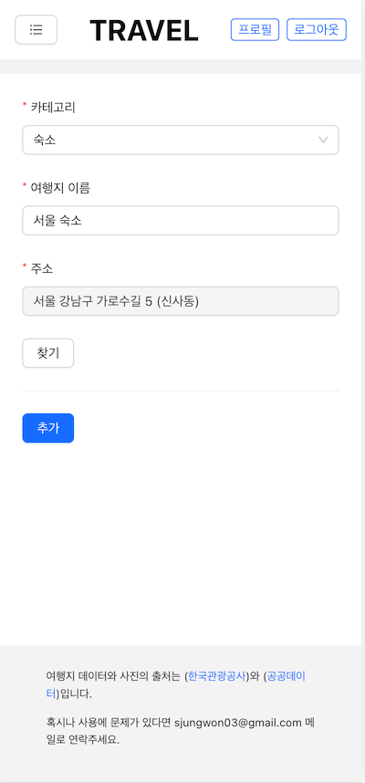
   3. 여행지 상세 조회  
      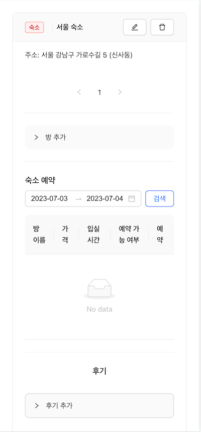
2. 후기
   1. 후기 추가  
      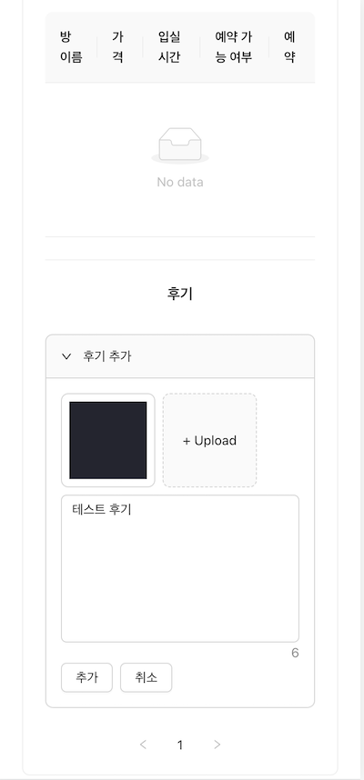
   2. 후기 조회  
      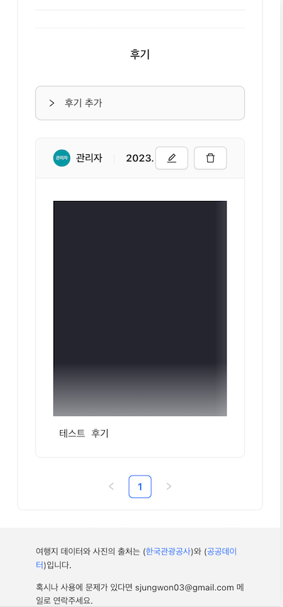
3. 여정
   1. 여정 추가  
      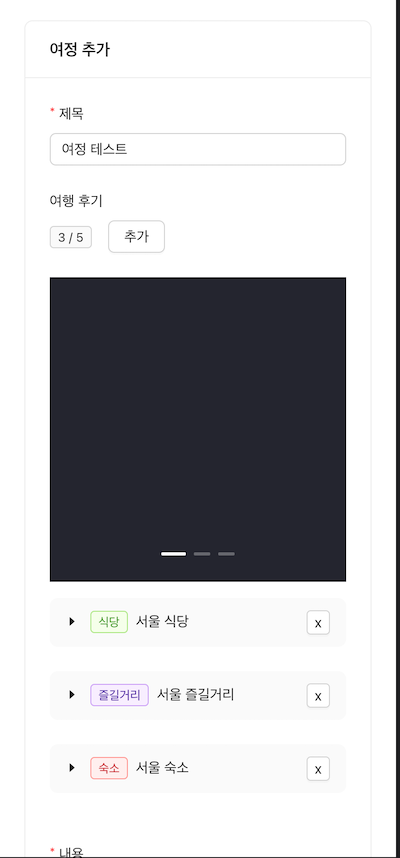
   2. 여정 조회  
      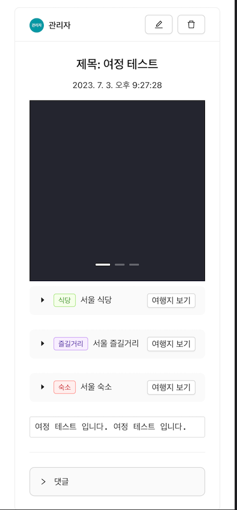
4. 방
   1. 방 추가  
      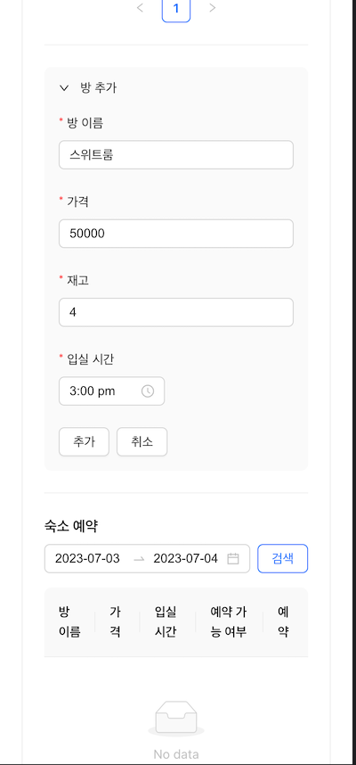
5. 예약
   1. 방 예약  
      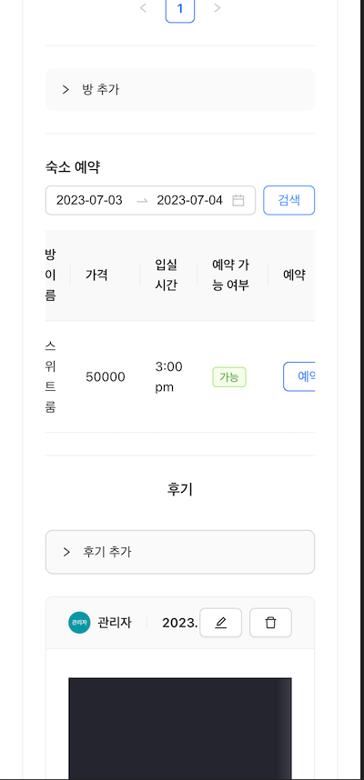
   2. 결제 페이지  
      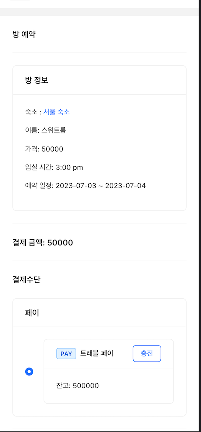
   3. 결제 내역  
      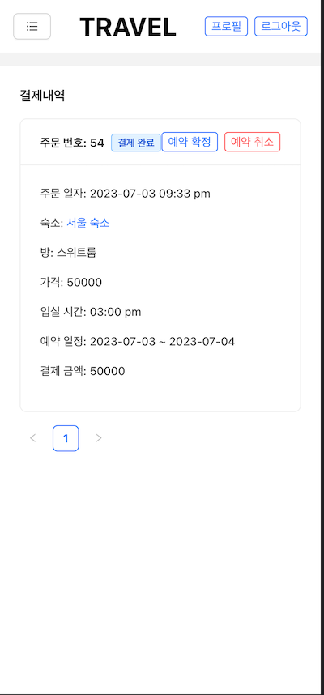
6. 회원 관리
   1. 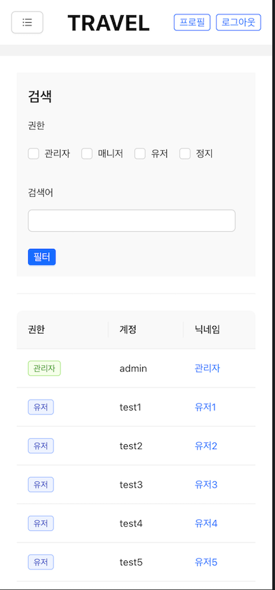
